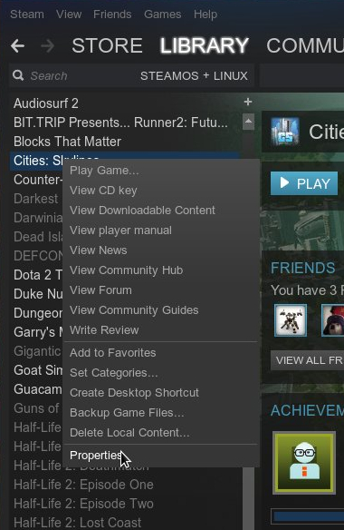
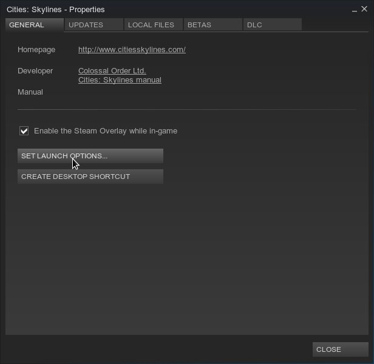
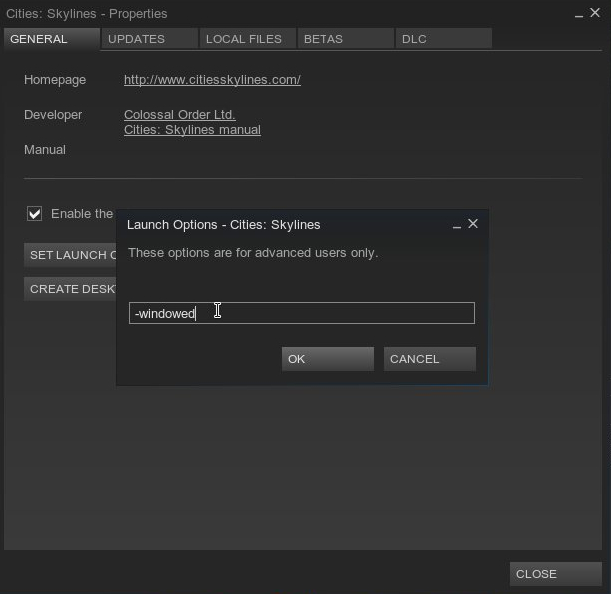

Title: Running Cities: Skylines on Fedora 21
Date: 2015-3-15
Category: Gaming
tags: Gaming, Linux
Author: Frank Hrach

Cities: Skylines is finally released with support for Windows, OSX, and Linux from day one! The game runs great on Windows, but if you are running it on Linux, you might be having some issues. My install crashed on every launch with only a black screen which required me to force quit the application. The fix to this is simple, but annoying. The game must be launched in windowed mode with the -windowed flag in Fedora 21. After the game launches is is safe to switch the game back to fullscreen mode in the options menu. Below are some screenshots showing how to add arguments in Steam.

